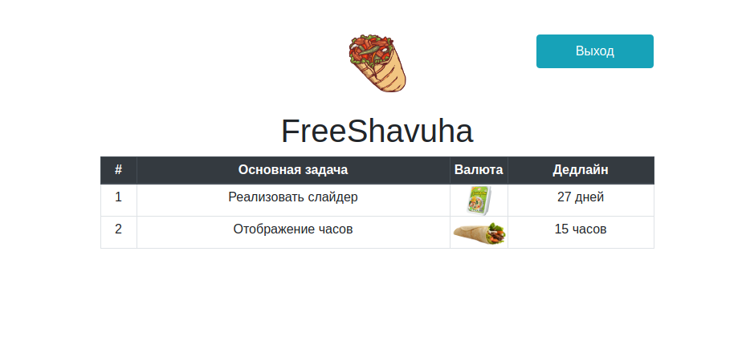
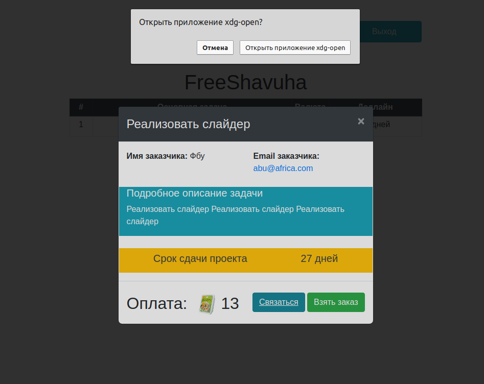
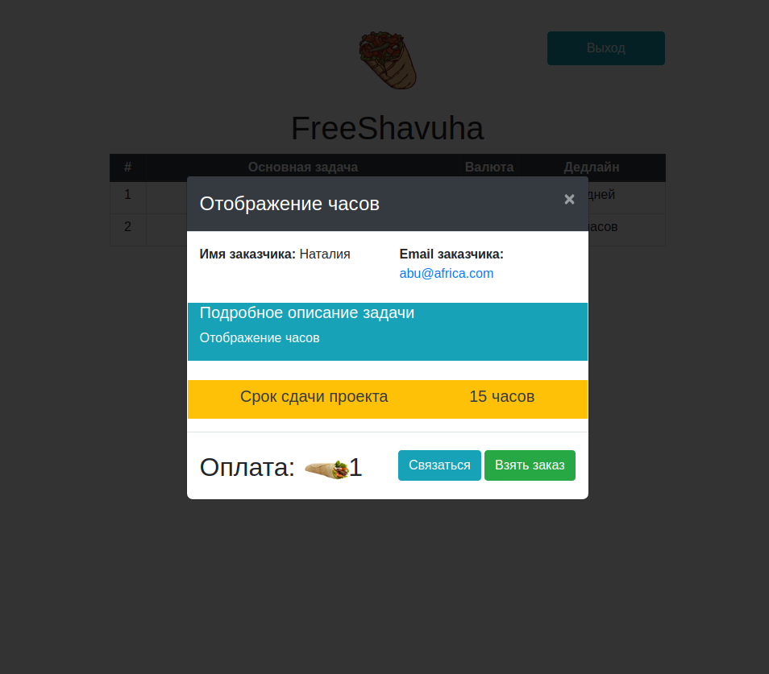

# Фриланс биржа JS

Фриланс биржа на которой существует форма отправки с валидацией

с возможнотью отслеживания дедлайна в зависимости от текущей даты со склонением слов
и если меньше двух дней, то с отслеживанием часов

а также с выводом заполненных форм с введенными значениями и активными кнопками

