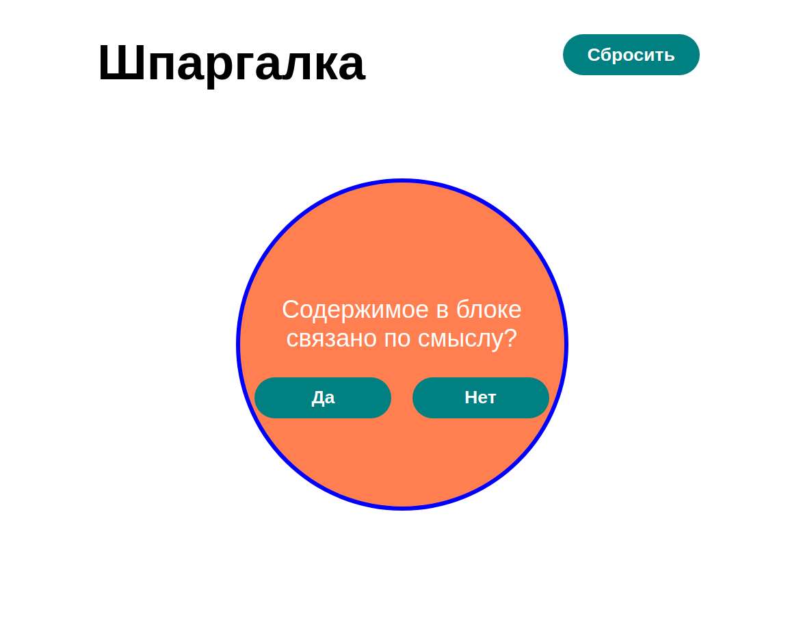

#Шпаргалка 

Познакомились с семантической вёрсткой и написали шпаргалку на JS с использованием css и его изменением из JS

С возможностью выбора ответа

И выводом результата в зависимости от выбора ответа

