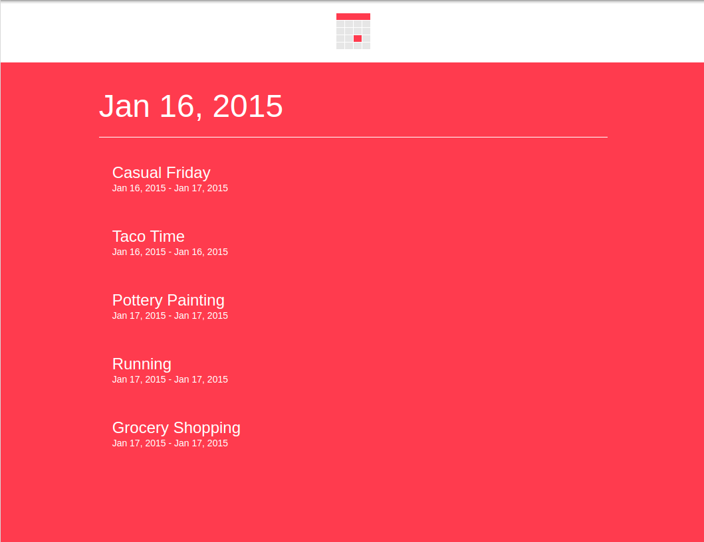
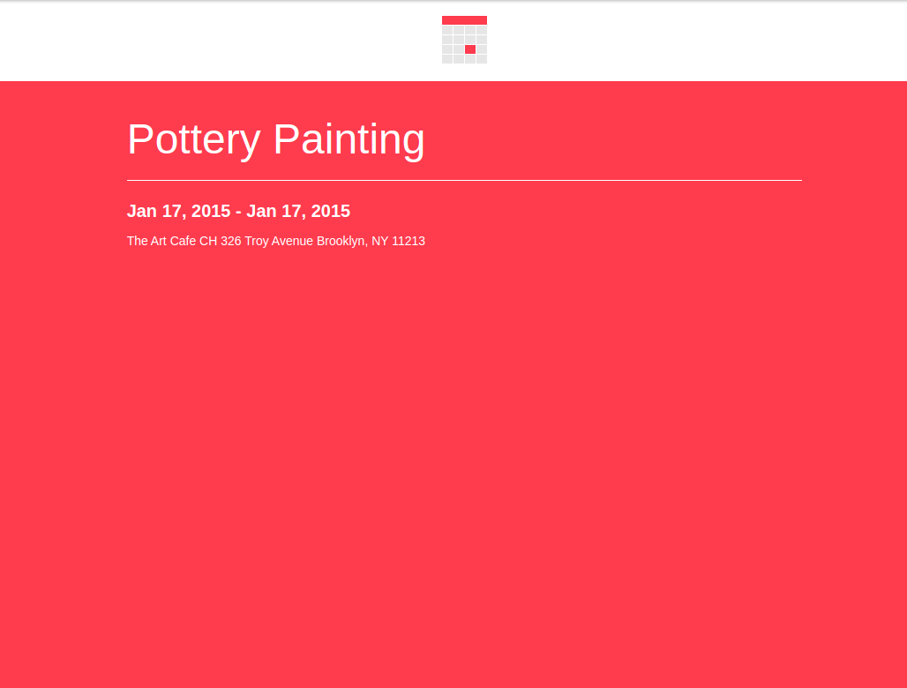

##### Calendar is creating an AngularJS app for their calendar service. The app displays a list of events in a single day. When you click on an event, it shows its details. https://aayamoldin.github.io/TrainingPrograms/codeacademy/Learn%20AngularJS%201.X/Projects/Calendar

###### CSS's and most of index.html (exept angular's parts) was made by  codeacademy

