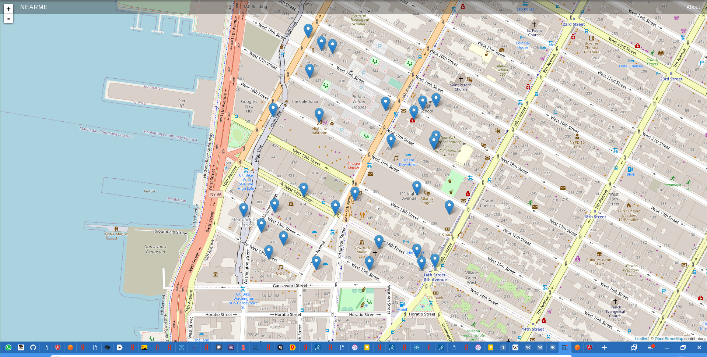
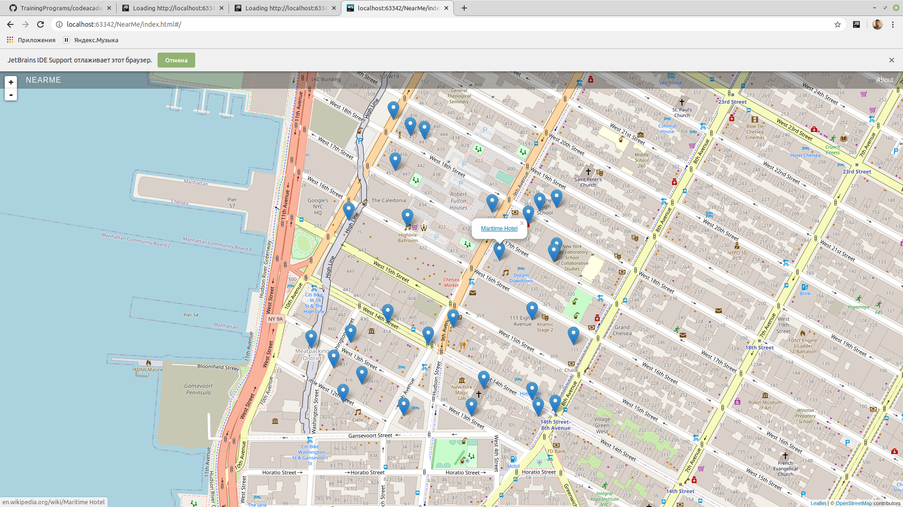
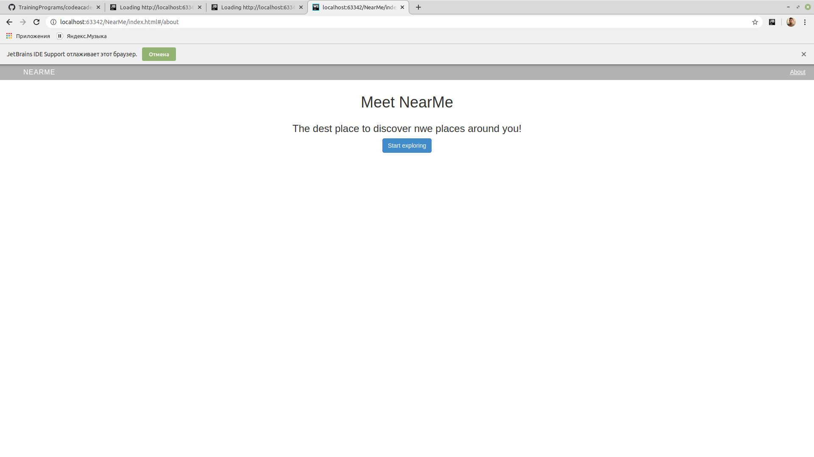

##### NearMe is creating an AngularJS app for their location-based service service. The app displays places of interest on a map. When you click on a map marker, a popup with a message displays.
##### https://aayamoldin.github.io/TrainingPrograms/codeacademy/Learn%20AngularJS%201.X/Projects/CapstoneProject/NearMe

