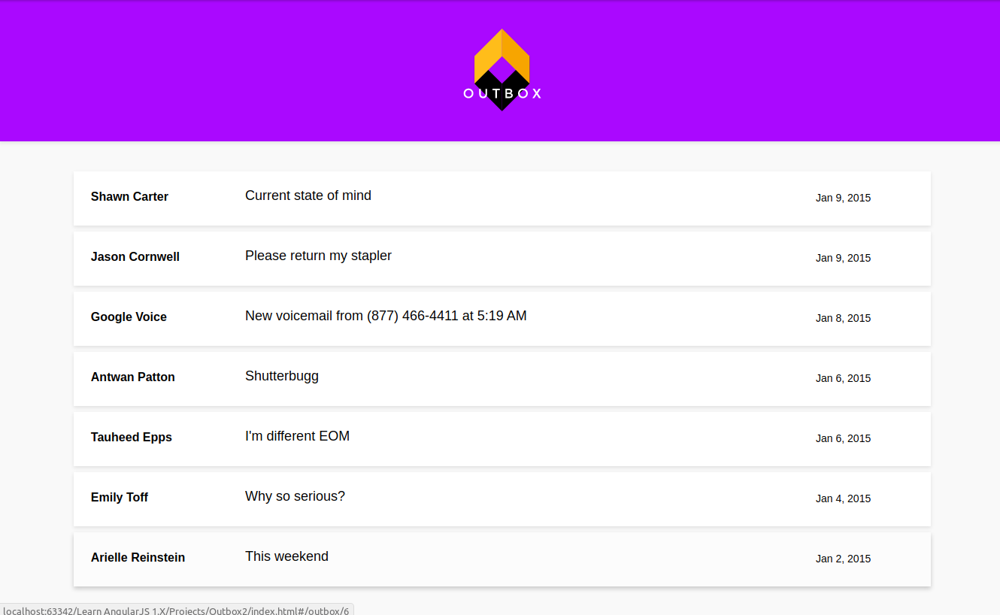
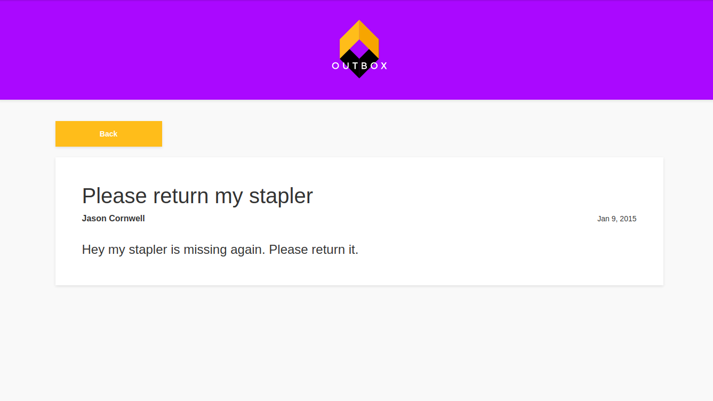

##### Outbox is creating an AngularJS app for their email app. The app displays a list of messages. When you click on an email, it shows the entire message. https://aayamoldin.github.io/TrainingPrograms/codeacademy/Learn%20AngularJS%201.X/Projects/Outbox2

