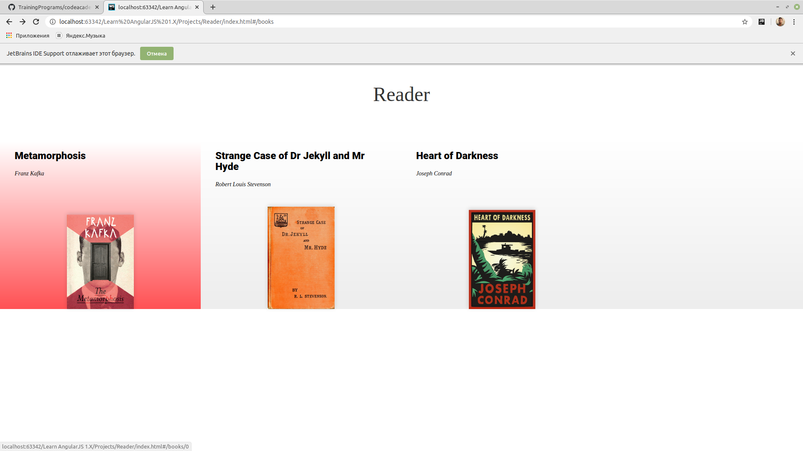
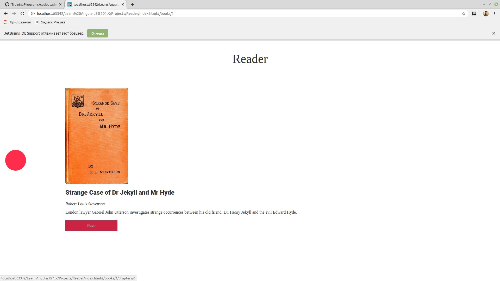
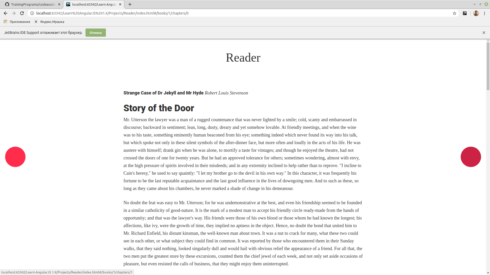

#### Reader is creating an AngularJS app for their e-reader service. 
##### The app displays a list of books on the home page.
##### When you click on a book, it takes you to the book’s description.
##### When you click the Read button, it takes you to the book’s first chapter. From there, you can use the Forward and Back buttons to read the book.
##### https://aayamoldin.github.io/TrainingPrograms/codeacademy/Learn%20AngularJS%201.X/Projects/Reader
###### CSS's and most of index.html (exept angular's parts) was made by codeacademy

